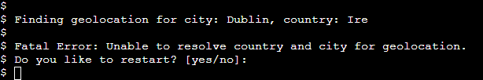
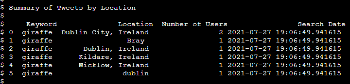

<h1 align=center> Search your brand on Twitter</h1>

If you would like to check how your brand is being commented on Twitter, this is your app! 

Search youur brand will search tweets containeing your preferred keyword in a 100km max range from you defined location and return to you a table with user's information, tweet content and where is the location with more results of your keyword.  
 

 ## Project Purpose

Create an app that can search tweets using Twitter API and outputs tweets with chosen keyword in a max range of 100km in tables on Google Spreadsheets. Also create a table data with all tweets location grouped and counted.  

## User Experience

### User Stories

+ As a user, I would like to be able to …

1.  easily add my information as City, Country, language and keyword;
2. easily check if my information are correct;
3.  decide if I want to get outputs on my command line or just save data on Google spreadsheets;
4. check my created data on Google Spreadsheet.

### App Owner Stories

+ As App Owner Stories, I would like to be able to provide …

1.  a simple, straightforward intuitive user experience;
2. clear output data on command line or  cloud storage;
3. user's feedback in case of wrong input;

## Features

#### Welcome message 

 Welcome user to app. 

#### User options
Ennable user to choose some options as Country, City, Keyword and Preferred Language. 

If City or Country options could't be validated by geolocation function the user has option to restart and try again. 

User can choose between four different languages to search on Twitter (English-en, Spanish-es, Portuguese-pt and German-de)
English language is set by default if user doen't want to set his own choice or write any wrong option. 

#### Returning user defined options.

Allows user to review options setted to the app in order to search tweets and choose to get data output on command line or not.  
If user set yes all the data collected from Twitter will be print on command line. 

Tweets table has some columns added from Twitter API (marked with a red line on image below) as: tweet creation date, tweet text, username and location. 
Search date, keyword and language were added to table (marked with a green line on image below)in order to add information about internal app search details. 

#### 

