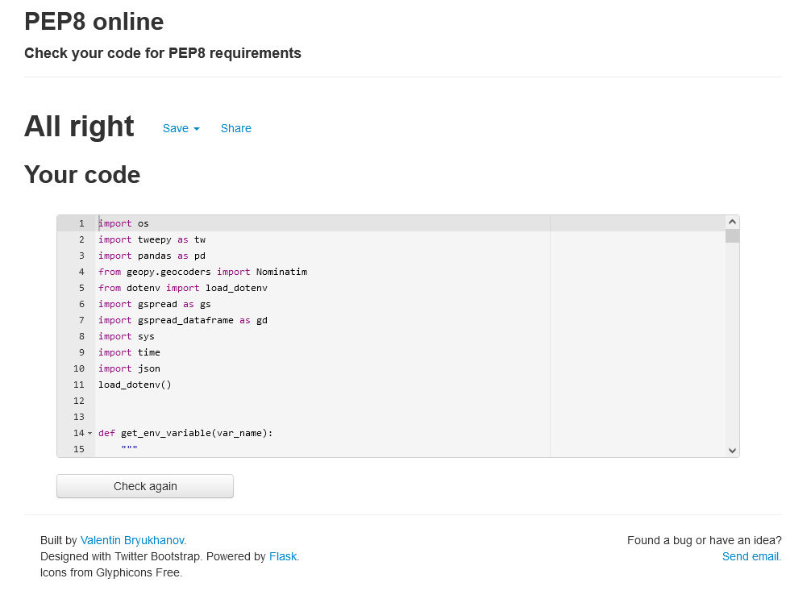

<h1 align=center> Search your brand on Twitter</h1>

If you would like to check how your brand is being commented on Twitter, this is your app! 

Search youur brand will search tweets containeing your preferred keyword in a 100km max range from you defined location and return to you a table with user's information, tweet content and where is the location with more results of your keyword.  
 

 ## Project Purpose

Create an app that can search tweets using Twitter API and outputs tweets with chosen keyword in a max range of 100km in tables on Google Spreadsheets. Also create a table data with all tweets location grouped and counted.  

## User Experience

### User Stories

+ As a user, I would like to be able to …

1.  easily add my information as City, Country, language and keyword;
2. easily check if my information are correct;
3.  decide if I want to get outputs on my command line or just save data on Google spreadsheets;
4. check my created data on Google Spreadsheet.

### App Owner Stories

+ As App Owner Stories, I would like to be able to provide …

1.  a simple, straightforward intuitive user experience;
2. clear output data on command line or  cloud storage;
3. user's feedback in case of wrong input;

## Features

#### Welcome message 

 Welcome user to app. 

#### User options
Ennable user to choose some options as Country, City, Keyword and Preferred Language. 

If City or Country options could't be validated by geolocation function the user has option to restart and try again. 

User can choose between four different languages to search on Twitter (English-en, Spanish-es, Portuguese-pt and German-de)
English language is set by default if user doen't want to set his own choice or write any wrong option. 

#### Returning user defined options.

Allows user to review options setted to the app in order to search tweets and choose to get data output on command line or not.  
If user set yes all the data collected from Twitter will be print on command line. 

Tweets table has some columns added from Twitter API (marked with a red line on image below) as: tweet creation date, tweet text, username and location. 
Search date, keyword and language were added to table (marked with a green line on image below)in order to add information about internal app search details. 

## Future Features

I would like to add:

    
## Languages Used

    Python 3.0

## Frameworks, Libraries & Programs Used

    Git Git was used for version control by utilizing the Gitpod terminal to commit to Git and Push to GitHub.
    GitHub: GitHub is used to store the projects code after being pushed from Git.
    Google Spreadsheets API:
    Twitter API:
    Grammarly: Used to correct any mistakes on readme and app text.
    Tweepy: 
    Pandas: 
    Geopy: 

## Testing and Code validation 

All testing and code validation details are described in a separeted file called TESTING.mg and can be found [here](TESTING.md).

#Deployment 

This app is deployed using Heroku.

 ### Heroku Deployment steps:
 
 1. Ensure all dependencies are listed on requirements.txt. 
 
 Write on python terminal ` pip3 freeze > requirements.txt"` and a list with all requirements will be created to be read by Heroku. 
 
 2. Setting up your Heroku

    2.1 Go to heroku website (https://www.heroku.com/). 
	2.2 Login to Heroku and go to Create App.

	2.3 Click in New and Create new app

	2.4 Choose a name and set your location

 	2.5. Navigate to the deploy tab

  	2.6. Click in Connect to Github and Search for 'nandabritto' GitHub account and 'search_your_brand' repository

  	2.7.  Navigate to the settings tab

  	2.8.  Click on Config Vars, and add your Twitter and Google Sheets API keys, Google Spreadsheets file and worksheets names. 

 	2.9. Click on Add a buildpack on the same page. Select Python and node.js, ensuring Python is listed first after you save the changes.

 
 3. Deployment on Heroku
   
 	3.1.  Navigate to the Deploy tab.

	3.2.  Choose main branch to deploy and enable automatic deployment to build heroku everytime any changes ar push on repository.

    3.3 Click on manual deploy to build the app.  When complete, click on View to redirect to live site. 

### Forking the GitHub Repository:

By forking the GitHub Repository you will be able to make a copy of the original repository on your own GitHub account allowing you to view and/or make changes without affecting the original repository by using the following steps:

    Log in to GitHub and locate the GitHub Repository
    At the top of the Repository (not top of page) just above the "Settings" Button on the menu, locate the "Fork" Button.
    You should now have a copy of the original repository in your GitHub account.

Making a Local Clone

    Log in to GitHub and locate the GitHub Repository
    Under the repository name, click "Clone or download".
    To clone the repository using HTTPS, under "Clone with HTTPS", copy the link.
    Open Git Bash
    Change the current working directory to the location where you want the cloned directory to be made.
    Type git clone, and then paste the URL you copied in Step 3.

$ git clone https://github.com/nandabritto/search_your_brand

    Press Enter. Your local clone will be created.

