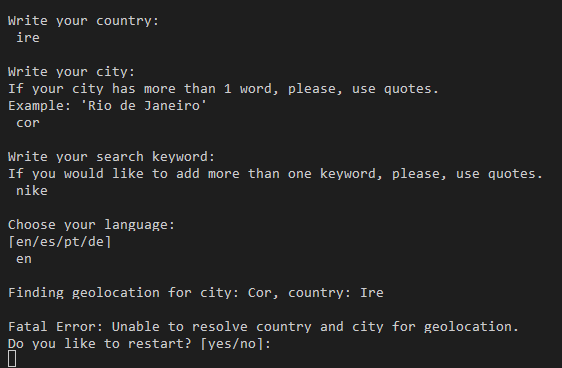
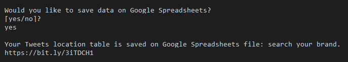
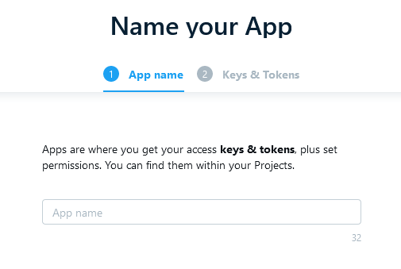

<h1 align=center> Search your brand on Twitter</h1>

If you would like to check how your brand is being commented on Twitter, this is your app! 

Search your brand" will search tweets containing your preferred keyword in a 100km max range from your defined location and return to you a table with user's information, tweet content and the locations with more results of your keyword. In this current version, we even supporting Export of retrieved outputs into Google Spreadsheets, allowing further data analysis.  
 

Live app link [here](https://search-your-brand.herokuapp.com/)

 ## Project Purpose

Create an app that can search tweets using Twitter API and outputs tweets with a chosen keyword in a max range of 100km. Also, create a table data with all tweets location grouped and counted.   Data created can be viewed on Terminal or stored on Google Spreadsheets. 

## User Experience

### User Stories

+ As a user, I would like to be able to …

1. easily add my preferred information like City, Country, language and keyword;
2. easily check if my information is correct;
3. decide if I want to get outputs on my terminal or just save data on Google spreadsheets;
4. check my created data on Google Spreadsheet.

### App Owner Stories

+ As App Owner Stories, I would like to be able to provide …

1. a simple, straightforward intuitive user experience;
2. clear output data on the terminal or  cloud storage;
3. user's feedback in case of wrong input.

## Functional Scope 

The following flowchart shows the flow of "Search your brand" graphically.

## Features

### Welcome message 

 Welcome user to the app. 

### User options
Enable user to choose some options as Country, City, Keyword and Preferred Language. 

If City or Country options couldn't be validated by the geolocation function the user has the option to restart and try again. 

Users can choose between four different languages to search on Twitter (English-en, Spanish-es, Portuguese-pt and German-de)
The English language is set by default if the user doesn't want to set his own choice or write any wrong option. 

### Returning user defined options.

Allows the user to review options set to the app in order to search tweets and choose to get data output on the termial or not.  
If the user set yes all the data collected from Twitter will be print on the terminal. 

Tweets table has some columns added from Twitter API (marked with a red line on the image below) as tweet creation date, tweet text, username and location. 
Search date, keyword and language were added to the table (marked with a green line on the image below)in order to add information about internal app search details. 

### Google Spreadsheets save option

Allows the user to save Tweets data created on Google Spreadsheets. A link for current spreadsheets file deployed on Heroku is also available, facilitating users trying app there navigation.

* Tweets table on Gspreadsheets

* Tweets by location table on Gspreadsheets

## Future Features

I would like to ...

1. return to use argparse modules to make it easy to write user-friendly command-line interfaces;
2. add more language options on Tweets Search;
3. add options to search data in different social media like Instagram, Facebook and Tik Tok;
4. add a user option to save data on different files formats like CSV and APACHE PARQUET;
5. dinamic create a short link to the google spreadsheets defined;
6. use tweets_count data frame to add a pin in a map to better visualization about tweets location.

## Languages Used

Python 3.0

## Frameworks, Libraries & Programs Used

Grammarly: Used to correct any mistakes on readme and app text.
Git: Git was used for version control by utilizing the Gitpod terminal to commit to Git and Push to GitHub.
GitHub: GitHub is used to store the project's code after being pushed from Git.
Google Spreadsheets API: Used to storage Search table data. 
Geopy: Used to locate the user's coordinates based on city and country.
Pandas: Used for data analyse and dataframe creation. 
Tweepy: Used to access the Twitter API with Python. 
Twitter API: Used to interact and get Tweets Data related to user keyword.

## Testing and Code validation 

All testing and code validation details are described in a separate file called TESTING.mg and can be found [here](TESTING.md).

## Project Bugs and Solutions:

| Bugs              | Solutions |
| ---               | --------- |
| When a user adds a country or city that is not recognized by geopy library, no country or city parameters were passed to tweepy, failing API call| Add an error handling to test if the location is None and raise an exception, print the error and allows user restart the app to add new parameters. 
| When tested on Heroku prints and inputs were hidden because of a lack of new line after code. | Add a new line after every input and print text to allows Heroku to show it and allows the app to flow correctly. 
| During tests when the user added a language using the entire word, an error was raised. Tweepy just recognizes language abbreviations. The same happened when a wrong abbreviation was input from the user. | To solve this bug just four languages can be used and an English default language was added in case language is None. For future releases, new languages will be added. 
| When tested, Heroku required all credentials to be Environment Variables. As best practice defined by Google, all variables were in a creds.json file. | Add google credentials in .env file as Environment Variables to allow Heroku to read it and load Google Spreadsheets API. 

## Deployment 

This app is deployed using Heroku.

Heroku Deployment steps 

 
 1. Ensure all dependencies are listed on requirements.txt. 
 
 Write on python terminal ` pip3 freeze > requirements.txt"` and a list with all requirements will be created to be read by Heroku. 
 
 2. Setting up your Heroku

    2.1 Go to Heroku website (https://www.heroku.com/). 
    2.2 Login to Heroku and go to Create App.
    
    
    
    
    
    2.3 Click in New and Create a new app
    
    
    
    2.4 Choose a name and set your location
    
    
    
    2.5. Navigate to the deploy tab
    
    
    
    2.6. Click in Connect to Github and search for 'nandabritto' GitHub account and 'search_your_brand' repository
    
    
    
    2.7.  Navigate to the settings tab
    
    
    
    2.8.  Click on Config Vars, and add your Twitter and Google Sheets API keys, Google Spreadsheets file and worksheets names.
    
    
    
    2.9. Click on Add a buildpack on the same page. Select Python and node.js, ensuring Python is listed first after you save the changes.
    
    

3. Deployment on Heroku

    3.1.  Navigate to the Deploy tab.
    
    
    
    3.2.  Choose main branch to deploy and enable automatic deployment to build Heroku everytime any changes are pushed on the repository.
    
    
    
    3.3 Click on manual deploy to build the app.  When complete, click on View to redirect to the live site. 
    
    

Forking the GitHub Repository 

* By forking the GitHub Repository you will be able to make a copy of the original repository on your own GitHub account allowing you to view and/or make changes without affecting the original repository by using the following steps:

    Log in to GitHub and locate the GitHub Repository
    At the top of the Repository (not top of page) just above the "Settings" button on the menu, locate the "Fork" button.
    You should now have a copy of the original repository in your GitHub account.

* Making a Local Clone

    Log in to GitHub and locate the GitHub Repository
    Under the repository name, click "Clone or download".
    To clone the repository using HTTPS, under "Clone with HTTPS", copy the link.
    Open Git Bash
    Change the current working directory to the location where you want the cloned directory to be made.
    Type git clone, and then paste the URL you copied in Step 3.

$ git clone https://github.com/nandabritto/search_your_brand

Press Enter. Your local clone will be created.

## Activating Google API Credential

API will allow our Python project to access and update data in our spreadsheet. 

API activating steps

1. Go to the google cloud website (https://cloud.google.com). 
2.Sign in or login to google cloud and click on the“Select a project and then select new project.

3. Add your project name and click in create. 

4. Navigate to API and Services

5. Click on Library

6. First enable Google Drive API

7. Second enable Google Sheets API.

8. Click in create credentials and fill out the form. (Service account Id must be copied from your table on google spreadsheets share option)

9. Click the Application data button.

1.0 Select I am not using them for compute engine, App engine or cloud platform.

11. Then click the next and then the done button.

12. Then go to APIs and Services, click credential then can see a service account.

13. Click the service account and Keys tab.

 

14. Click on the Add Key and select Create New Key. 

15. Select JSON and then click Create. 

16. This will trigger the JSON file with your API credentials in it to download to the computer. 

17. Add on your gitpod space. Copy all information from this file and add it to a .env file.

` CREDS = {all data from json file}`

## Activating Twitter API

API will allow our Python project to access data on the Twitter website.

API activating steps

1. Create a free Twitter user account(www.twitter.com)

2. Access the Twitter developer portal(https://developer.twitter.com/en)

3. Click on Projects and Apps

4. Click in Create a New App

5. Choose your app name and create. After this, you will have access to all keys. Copy and paste in a .env file on gitpod. 

# Credits

### Work based on other code

[EarthLab](https://www.earthdatascience.org/courses/use-data-open-source-python/intro-to-apis/twitter-data-in-python/) - Used as a base for firsts pieces of code on this project. 
[Kdnuggets](https://www.kdnuggets.com/2017/03/beginners-guide-tweet-analytics-pandas.html) - Used to understand better all pandas library functions used on this project. 
SamOh/trend_map Github - Used to  write function to get API variables from .env file. 
W3 Schools - Used to write some error handling codes on functions. 
[Learn Python with Rune](https://www.learnpythonwithrune.org/how-to-plot-locations-of-tweets-on-map-using-python-in-3-easy-steps/)- Used as a base for search tweets function.

# Acknowledgements

+ To the Slack community as I have used the different channels to find answers to problems!
+ Stack Overflow is a valuable resource for solving lots of issues.
+ W3schools and Python libraries documentation for general reference.

I would also like to thank:

+ My husband Guilherme for all the support on stressful moments, help to figure out lots of bugs and for reviewing everything.
+ My mentor Rahul Lakhanpal for his time, support and guidance.
+ Code institute tutors, for help with several issues and bugs.

