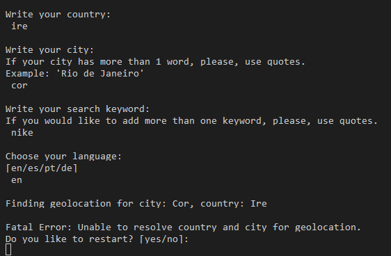
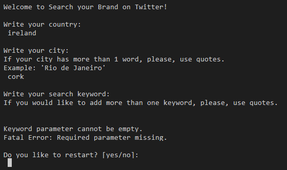
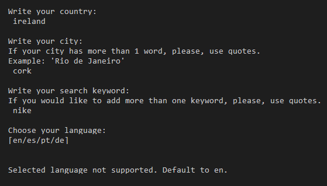
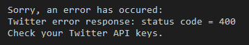
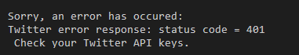
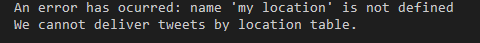
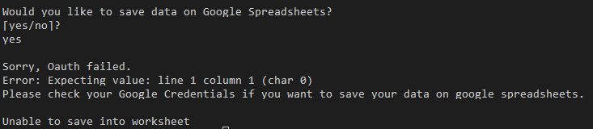
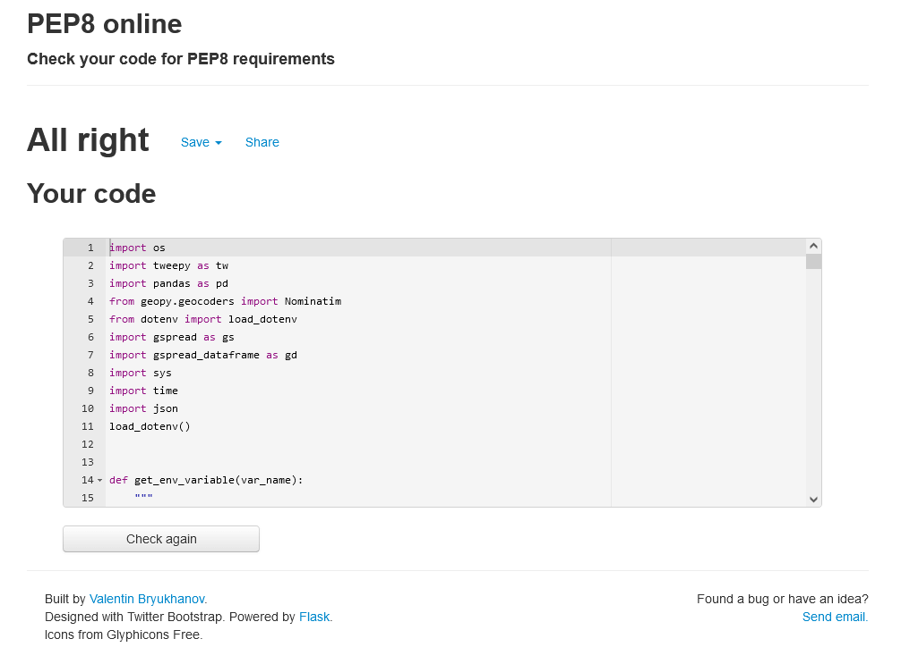

# Testing

During code development of each function tests were in place to be sure that it was running as expected. 
The following sections describe all tests done and error handling actions in place. 

## Pre-Deployment Tests

### Input Errors

Search your brand needs information from the user to proceed tweets search using Twitter API. This app was tested to prevent a crash in case of invalid inputs.  Some error scenarios were developed to ensure that users get information about what was wrong and fix the mistake before running the search. 

#### * Users input errors

##### 1.  Wrong city or country name:

If a user adds an invalid city or country the app cannot generate user geolocation to search tweets in a maximum range of 100km. In this way, a message is generated to inform the user about it. 

##### 2.  Keyword empty:

The main goal of the app is to search tweets based on a user choice keyword. If the user let this field empty, an error can be raised and a message about missing required parameter is delivered to the user. 

When errors 1 or 2  happens, the app asks if the user wants to restart or quit the app. 

##### 2.  No language choice:

Users can choose four different languages to procced search on Twitter. If any language had selected, an English default language is applied and proceed the searching. 

#### * Twitter API errors

##### Wrong or missing keys

If any key from Twitter API is wrong, missing or invalid, an error can be raised and make the tweets search impossible. To prevent a crash, the user is informed about it and the application is ended.

 Wrong key error

 Missing key error

##### No Tweets Location 

In case of an error on tweets location, the app can run but no tweets location can be generated. On this scenario, the user is informed about it on command line. 

#### * Google Spreadsheets API error

##### Wrong or missing keys

Apart from the Twitter API error, any error raised from Google Spreadsheets API doesn't stop the app to run. In this way, the error only will be raised if the user chooses to save data on google spreadsheets. In this scenario, a message will be delivered to inform it.  All other features can run without problems and data can be viewed on the command line.  

## Code Validation

* Automated tests

Passing code on [Pep8 Validator](http://pep8online.com/) no errors or warnings have been found.

* Manual Testing

  * Desktop

Mozilla Firefox, Google Chrome, Microsoft Edge: everything is working good. Page loads and all features are working.

  * Mobile

Tested with Xiaomi Mi6 and Xiomi Mi8 and webpage works well.

For a better experience is recommended to run the "Search Your Brand" app on Terminal. Heroku mock terminal has a small width which limits Tweets table visualization. If data is saved to GoogleSpreadsheets, tables visualization will be fully available.